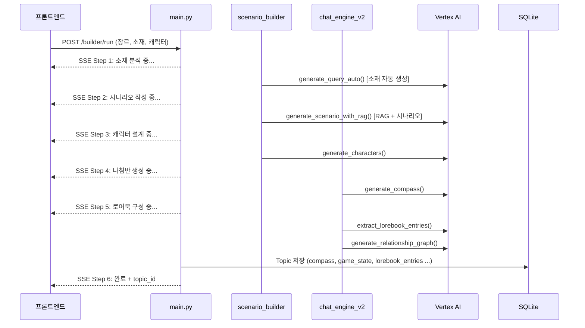
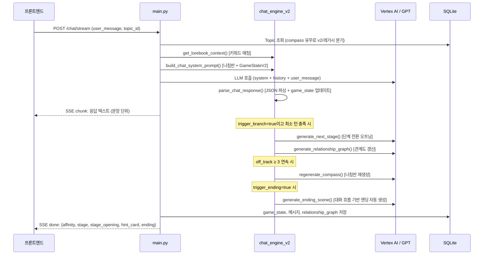

# Dive.ai 프로토타입 아키텍처 문서

---

## 1. 시스템 개요 (System Overview)

**목적**
Dive.ai는 사용자가 원하는 장르·소재·캐릭터를 입력하면 AI가 기승전결 시나리오와 캐릭터를 자동으로 설계하고, 그 서사 위에서 인터랙티브 채팅 롤플레이를 진행할 수 있도록 하는 AI 스토리텔링 플랫폼입니다.

핵심 기술 과제는 두 가지입니다.

1. **콘텐츠 생성 파이프라인** — 유저 입력(장르, 소재, 캐릭터 설정)을 받아 RAG 기반 씬 패턴 검색과 LLM 생성을 조합하여 시나리오·캐릭터·나침반·로어북을 자동으로 만들어냅니다.
2. **서사 일관성 유지 채팅** — 생성된 나침반(Compass)을 기반으로 대화 단계(기승전결)를 추적하면서, 이탈 감지·단계 전환·엔딩 생성을 자동으로 처리합니다.

**대상 독자**
프로젝트에 처음 합류한 개발자가 전체 그림을 파악하고, 어느 파일을 수정해야 하는지 빠르게 찾을 수 있도록 작성되었습니다.

---

## 2. 기술 스택 (Technology Stack)

### 백엔드

| 기술 | 선택 이유 |
|---|---|
| **Python 3.11** | LangChain·ChromaDB 생태계와의 호환성 |
| **FastAPI** | 빠른 프로토타이핑 + 네이티브 비동기(async) + SSE 스트리밍 지원 |
| **SQLAlchemy + SQLite** | ORM으로 스키마 관리 용이, 프로토타입 단계에서 별도 DB 서버 불필요 |
| **LangChain** | Google Gemini·Vertex AI 호출을 일관된 인터페이스로 추상화 |
| **ChromaDB** | 임베딩 벡터 로컬 저장·검색 (씬 89,851개 / 고전 12,717개) |

### AI 모델

| 모델 | 용도 |
|---|---|
| **gemini-3-flash-preview (Vertex AI)** | 채팅 및 빌더 파이프라인 기본 모델 |
| **gemini-3.1-pro-preview (Vertex AI)** | 엔딩 씬 생성 등 고품질 출력 필요 시 |
| **gemini-3.1-flash-lite-preview (Vertex AI)** | 단순 반복 작업용 |
| **gemini-3.1-flash-image-preview (Vertex AI)** | 이미지 생성 (캐릭터·표지·엔딩 이미지) |
| **gpt-5.4 (OpenAI)** | v2 채팅에서 GPT 모델 선택 시 사용 |
| **text-embedding-3-small (OpenAI)** | RAG 씬 검색용 임베딩 (`OPENAI_API_KEY`) |

### 프론트엔드

| 기술 | 선택 이유 |
|---|---|
| **React 18 + TypeScript** | 컴포넌트 재사용성, 타입 안정성 |
| **Vite** | 빠른 개발 서버, 빌드 속도 |
| **Tailwind CSS** | 별도 CSS 파일 없이 빠른 UI 프로토타이핑 |

---

## 3. 프로젝트 구조 (Project Structure / Directory Map)

```
Dive.ai_prototype/
│
├── main.py               ← FastAPI 진입점. 모든 API 라우팅 담당
├── ai_engine.py          ← LLM 팩토리 + Vertex AI 공용 호출 헬퍼
├── scenario_builder.py   ← 빌더 파이프라인 로직 + ChromaDB RAG 검색
├── chat_engine_v2.py     ← v2 채팅 엔진 (나침반·GameStateV2·로어북 등)
├── prompt_builder.py     ← 레거시 채팅용 시스템 프롬프트 조립
├── memory.py             ← 레거시 채팅용 장기기억(요약) 관리
├── models.py             ← SQLAlchemy ORM 테이블 정의
├── database.py           ← DB 연결 설정 (engine, get_db)
├── auth.py               ← Firebase 인증 + JWT 토큰 발급
├── ingest_data.py        ← (오프라인) 벡터DB 데이터 적재 스크립트
│
├── .env                  ← API 키 및 환경변수 (git 제외)
├── sql_app.db            ← SQLite DB 파일
├── requirements.txt
│
├── frontend/             ← React + TypeScript 프론트엔드
│   └── src/
│       ├── App.tsx                  ← 탭 라우터 + FlowData 상태 관리
│       ├── types.ts                 ← 공유 타입 (FlowData, SessionOptions 등)
│       └── components/
│           ├── Screen0.tsx          ← 홈 (랜딩)
│           ├── Screen1.tsx          ← 빌더 Step 1: 콘텐츠 유형·장르 선택
│           ├── Screen2.tsx          ← 빌더 Step 2: 소재·캐릭터 입력
│           ├── Screen3.tsx          ← 빌더 Step 3: 파이프라인 실행 (SSE)
│           ├── Screen4.tsx          ← 빌더 Step 4: 결과 확인·편집
│           ├── Screen5.tsx          ← 빌더 Step 5: 세션 옵션 설정
│           ├── ChatInterface.tsx    ← 채팅 대화 화면 (SSE 수신)
│           ├── ChatList.tsx         ← 채팅방 목록
│           └── Settings.tsx         ← 마이 페이지
│
└── ../vectordb/          ← ChromaDB 벡터DB (백엔드 상위 디렉토리)
    ├── scenes            ← 씬 패턴 컬렉션 (89,851개)
    └── classics          ← 동아시아 고전 컬렉션 (12,717개)
```

---

## 4. 핵심 컴포넌트 및 상호작용 (Key Components & Interaction)

### 컴포넌트 블록 다이어그램

```
┌─────────────────────────────────────────────────────────┐
│                     Frontend (React)                    │
│  [Screen1~5 빌더 플로우]  [ChatInterface]  [ChatList]   │
└─────────────┬───────────────────┬───────────────────────┘
              │ POST /builder/run │ POST /chat/stream
              │ (SSE)             │ (SSE)
┌─────────────▼───────────────────▼───────────────────────┐
│                  main.py (FastAPI)                       │
│   라우팅·CORS·DB 초기화·SSE 생성기 조합                   │
└───┬─────────────┬──────────────────┬────────────────────┘
    │             │                  │
    ▼             ▼                  ▼
scenario_    chat_engine_v2     prompt_builder
builder.py   .py                .py + memory.py
(빌더 파이프라인)  (v2 채팅 엔진)   (레거시 채팅)
    │             │
    └──────┬──────┘
           ▼
       ai_engine.py
    (vertex_complete)
           │
     ┌─────┴──────┐
     ▼            ▼
 Vertex AI     OpenAI
 (서비스 계정)  (API Key)
     │            │
     └─────┬──────┘
           ▼
        ChromaDB (RAG)
        ← OpenAI 임베딩
```

---

### 데이터 흐름 1: 빌더 파이프라인



---

### 데이터 흐름 2: v2 채팅 스트림



---

### 채팅 엔진 라우팅

`POST /chat/stream`에서 `topic.compass` 컬럼의 유무로 엔진을 자동 분기합니다.

```
topic.compass 있음 → _chat_stream_v2()  (GameStateV2 + 나침반 기반)
topic.compass 없음 → generate_legacy()  (LangChain 스트리밍, 하위 호환)
```

빌더 파이프라인을 통해 생성된 토픽은 항상 `compass`를 가지므로 v2 엔진을 사용합니다.

---

### GameStateV2 상태 머신

```
기 (Opening)  →  승 (Rising)  →  전 (Climax)  →  결 (Ending)
   최소 8턴        최소 13턴       최소 9턴       최소 3턴 + trigger_ending=true

※ 스토리 길이(short/normal/long)에 따라 최소 턴이 달라짐
  short:  기 4 / 승 6  / 전 5  / 결 2  (~17턴)
  normal: 기 8 / 승 13 / 전 9  / 결 3  (~33턴)  ← 기본값
  long:   기 15/ 승 26 / 전 18 / 결 6  (~65턴)

affinity: -100 ~ +100  (단계별 delta cap: 기±3 / 승±5 / 전±8)
off_track_count: 3 연속 → regenerate_compass() 호출
```

---

## 5. 설계 원칙 및 패턴 (Design Principles / Patterns)

### 레이어드 아키텍처

```
[API Layer]       main.py               ← HTTP, SSE, 에러 변환
[Engine Layer]    chat_engine_v2.py     ← 서사 상태·로직
                  scenario_builder.py   ← 콘텐츠 생성 파이프라인
[Infra Layer]     ai_engine.py          ← LLM 초기화·호출
                  database.py           ← DB 연결
[Data Layer]      models.py             ← ORM 테이블 정의
```

### 주요 불변성 (Invariants)

**AI 인프라 격리**
`ai_engine.py`는 FastAPI를 import하지 않습니다. LLM 오류는 `ValueError`로 raise하고, `main.py`에서 `HTTPException`으로 변환합니다. 이 규칙을 지켜야 `ai_engine.py`를 독립적으로 테스트할 수 있습니다.

**단방향 의존성**
`main.py → engine/builder → ai_engine` 방향만 허용합니다. 순환 import가 없어야 합니다.

**v2 엔진 활성화 조건**
`topic.compass != None`이 v2 엔진의 유일한 활성화 조건입니다. 빌더 파이프라인을 거치지 않고 수동으로 생성한 토픽은 레거시 엔진을 사용합니다.

**최소 단계 유지 (Stage Gate)**
`parse_chat_response()`의 백엔드 게이트가 `MIN_STAGE_TURNS` 미충족 시 `trigger_branch`/`trigger_ending`을 강제로 `False`로 처리합니다. LLM이 프롬프트를 무시해도 단계가 조기에 전환되지 않습니다.

**유저 지정 필드 보호**
`generate_characters()`는 LLM이 유저가 입력한 캐릭터 필드를 덮어쓰더라도 원본 값을 강제 복원합니다.

**SSE 스트리밍 일관성**
모든 SSE 이벤트는 `_sse(dict)` 헬퍼를 통해 `data: {json}\n\n` 형식으로 통일합니다.

### 패턴

- **팩토리 패턴**: `get_llm()`, `get_vertex_llm()`이 모델명 문자열을 받아 LLM 인스턴스를 반환합니다.
- **전략 패턴**: `/chat/stream`에서 `compass` 유무에 따라 v2/레거시 생성기를 교체합니다.
- **SSE 스트리밍**: 빌더 파이프라인과 채팅 모두 `StreamingResponse`로 단계별 진행 상황을 실시간 전송합니다.

---

## 6. 인프라 및 배포 (Infrastructure & Deployment)

### 현재 상태 (프로토타입)

현재는 로컬 단일 서버 환경에서 동작합니다. 별도 CI/CD 파이프라인은 구성되지 않았습니다.

**백엔드 실행**
```bash
python main.py
```

**프론트엔드 개발 서버**
```bash
cd frontend && npm run dev
```

**프론트엔드 프로덕션 빌드**
```bash
cd frontend && npm run build
# 결과물: frontend/dist/ (정적 파일)
```

### 외부 서비스 의존성

| 서비스 | 인증 방식 | 비고 |
|---|---|---|
| Google Vertex AI | `GOOGLE_APPLICATION_CREDENTIALS` (서비스 계정 JSON) | 모든 Gemini 모델 (빌더·채팅·이미지) |
| OpenAI | `OPENAI_API_KEY` | RAG 임베딩 + GPT 모델 |
| Firebase Auth | `FIREBASE_SERVICE_ACCOUNT_PATH` (서비스 계정 JSON) | 구글 소셜 로그인 인증 |

### 데이터 저장소

| 저장소 | 위치 | 내용 |
|---|---|---|
| SQLite | `sql_app.db` | 사용자·토픽·메시지·요약·페르소나 |
| ChromaDB | `../vectordb/` | 씬 패턴·고전 임베딩 (읽기 전용) |

### 향후 배포 고려사항

- SQLite → PostgreSQL 전환 시 `database.py`의 연결 문자열만 변경하면 됩니다.
- 프론트엔드 정적 파일을 FastAPI에서 직접 서빙하거나(StaticFiles 마운트) CDN으로 분리하는 방식 모두 가능합니다.
- Vertex AI 서비스 계정 JSON은 GCP Secret Manager 또는 환경변수로 관리해야 합니다.
